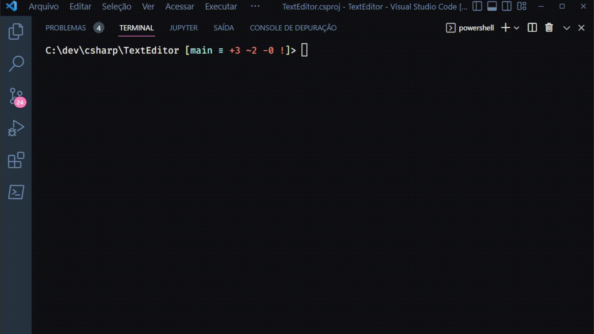

### Text Editor App

This application is a simple Text file editor.

Through the CLI, we can write texts into .txt files, that will be saved on a path of our choice.

This applications was built with C#.

### How it works

- Run `dotnet run` in your terminal;
- Pick a option from the menu:
  0 - Exit
  1 - Open file
  2 - Create file

  IF 1, you will be able to read the existent content of a txt file, from a specified path. Then the application will print the file content in the terminal.

  IF 2, you will be able to write a text in a .txt file. Which path will be set via CLI.

  IF 0, you will finish the app.

  

    
  
